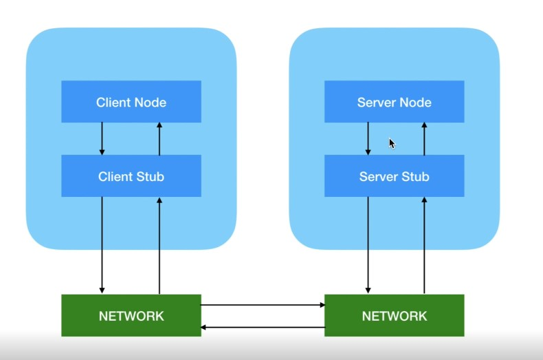

# Basic Remote Procedure Call App
### gRPC - alternative for REST API
For example, let's say we have a client and a server, and suppose the server has a specific method. The remote procedure call paradigm means that we can invoke this method on the client. The client does not have this method, but we can enable a remote method invocation and call the method on the client using an object called the ***Stub***

Here are the main differences between ***gRPC*** and **REST**:
1. gRPC uses HTTP/2 for transport, while REST typically uses HTTP/1.1.
2. gRPC employs Protocol Buffers for serialization, while REST usually leverages JSON or XML.
3. gRPC is based on the RPC (Remote Procedure Call) paradigm, while REST follows the architectural constraints of the Representational State Transfer model.
4. gRPC supports bidirectional streaming, whereas REST is limited to request-response communication patterns.
## Installation
```dzigga
git clone https://github.com/IBetULookGood/gRPC-Client-Server-App.git
```